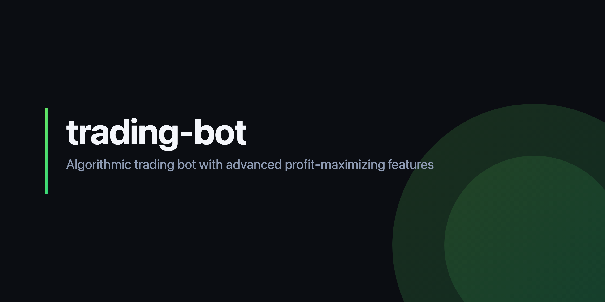

# trading-bot

<p align="center">
  
</p>

Personal algorithmic-trading sandbox on Alpaca, async Python.

**Status:** experimental, paper-only, no proven edge. Do not deploy real capital.

**Coming back to this repo?** Read [`results/where_we_landed.md`](results/where_we_landed.md) first — durable summary of the May 2026 cleanup + validation, including the 2026-08-17 addendum. Headline: at matched (~92%) gross exposure the strategy returns +42.9% vs SPY buy-and-hold +95.3% with a worse Sharpe (0.52 vs 0.75). The earlier "-7% max DD drawdown control" story was an exposure artifact — max drawdown scales roughly linearly with exposure.

## What's in here

- A momentum strategy (RSI/MACD/ADX with trailing stops).
- A mean-reversion strategy.
- An adaptive coordinator that switches between them based on market regime.
- A backtest engine with realistic slippage and spread.
- A risk manager (VaR, correlation, position sizing).
- A circuit breaker (daily-loss halts).
- An Alpaca broker wrapper (paper + live).

Plausible-but-unvalidated quant work — factor models, pairs trading, cross-asset signals, walk-forward validation, alpha-decay monitoring — is in `research/`, excluded from the production path and the default test run.

## Quickstart

```bash
pip install -r requirements.txt
cp .env.example .env  # add ALPACA_API_KEY, ALPACA_SECRET_KEY, PAPER=True

pytest tests/
python main.py backtest --strategy MomentumStrategyBacktest --start-date 2024-01-01 --end-date 2024-12-31
python main.py live --strategy adaptive
```

## Performance

The canonical reference is `results/etf_baseline_2020-2024_exposure_sweep.md` — SPY/QQQ/IWM/EFA (broad ETFs that can't be delisted or selection-biased), regenerated 2026-08-18 after fixing the last structural backtest defect: the strategy could never exit a position on its own signal. **With exits working, the gross-100 run returns +16.4% / Sharpe 0.16 (26 trades, ~59% realized gross) vs SPY buy-and-hold +95.3% / Sharpe 0.75 — the strategy's own exit timing subtracts value at every exposure level.**

Every earlier headline is superseded: "+42.9% at 92% gross" (2026-08-17) measured enter-once-and-hold — beta, not the strategy; `etf_baseline_2020-2024.md` (+53.4%) and `honest_backtest_2020-2024.md` (+646%, survivor-biased) carry SUPERSEDED banners. Don't quote any of them.

## License

MIT. See `LICENSE`.
